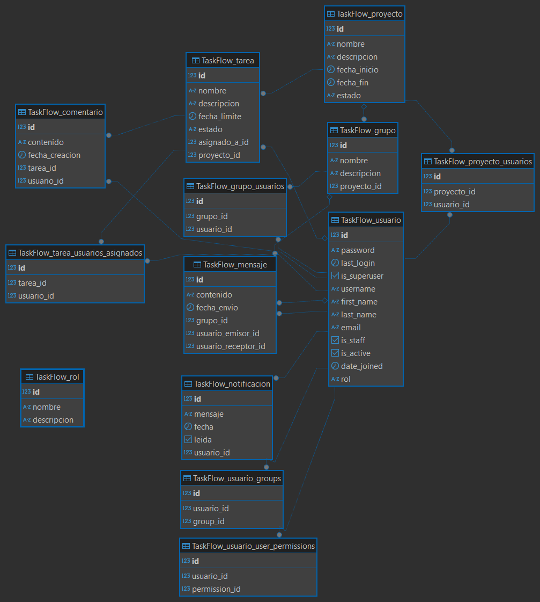
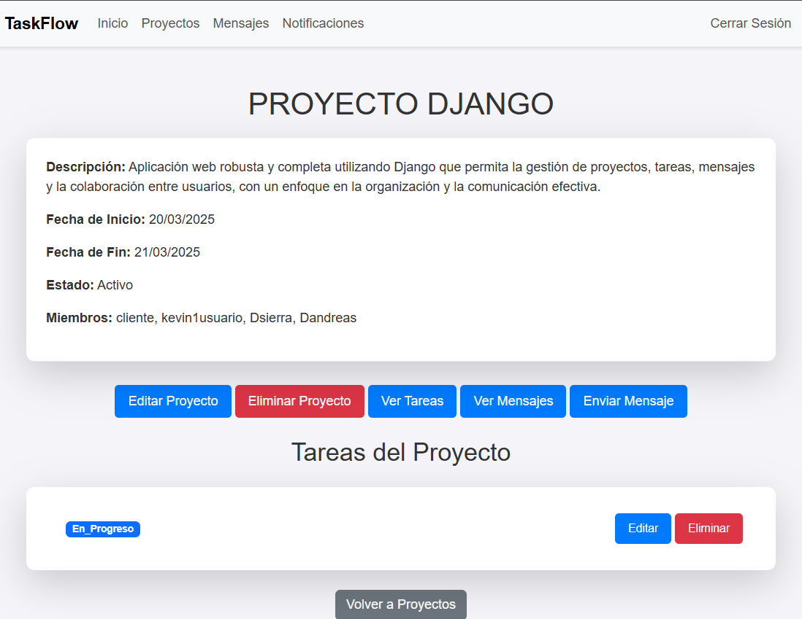

# Sistema de Comunicación Empresarial (TaskFlow)

## Descripción

**Sistema de Comunicación Empresarial** es una aplicación web desarrollada con Django que facilita la gestión de proyectos, tareas, mensajes y la colaboración entre usuarios dentro de una empresa. Permite a los usuarios crear proyectos, asignar tareas, enviar mensajes (individuales o grupales), recibir notificaciones en tiempo real, y colaborar de manera eficiente. La aplicación está diseñada para mejorar la comunicación y la productividad en equipos de trabajo.

### Características principales

- **Gestión de Proyectos**: Crear, editar, eliminar y visualizar proyectos con fechas de inicio y fin, estado (Activo, Finalizado, Cancelado) y miembros asociados.
- **Gestión de Tareas**: Crear, editar, eliminar y actualizar el estado de las tareas (Pendiente, En Progreso, En Revisión, Completada) dentro de un proyecto.
- **Mensajería**: Enviar mensajes individuales o grupales dentro de un proyecto, con opción de responder y eliminar mensajes (tanto enviados como recibidos).
- **Notificaciones**: Notificaciones en tiempo real para nuevos mensajes, tareas asignadas y actualizaciones.
- **Interfaz Estilizada**: Diseño responsive con Bootstrap y estilos personalizados para una experiencia de usuario agradable.
- **Autorización y Permisos**: Solo los superusuarios pueden editar o eliminar proyectos. Los miembros pueden gestionar tareas y mensajes.

### Estado actual

- **Entorno de desarrollo**:
  - Configurado con un entorno virtual (`andre`).
  - PostgreSQL instalado como base de datos en macOS (usando Homebrew) y Windows.
  - Base de datos `SystemCom` creada con codificación UTF-8.
  - Django configurado para usar PostgreSQL.
- **Repositorio**:
  - Creado un repositorio Git y subido a GitHub: [https://github.com/Andreas103-SI/AppComunicacion](https://github.com/Andreas103-SI/AppComunicacion).
  - Archivo `.gitignore` creado para ignorar archivos innecesarios (entorno virtual, archivos de base de datos, etc.).
- **Aplicación**:
  - Estructura básica de Django creada, incluyendo la aplicación `TaskFlow`.
  - Modelos, vistas, URLs y plantillas implementadas para proyectos, tareas, mensajes y notificaciones.
  - Autenticación y autorización de usuarios configurada.
  - Bootstrap integrado para el diseño de la interfaz de usuario.
  - Estilos personalizados añadidos en `static/css/style.css` para los mensajes y otras secciones.
  - Funcionalidades de mensajería y eliminación de mensajes (enviados y recibidos) implementadas.
  - Permisos ajustados: solo superusuarios pueden editar o eliminar proyectos.

### Próximos pasos

- Añadir un campo `creador` al modelo `Proyecto` para permitir que el creador del proyecto también pueda editarlo o eliminarlo (no solo superusuarios).
- Implementar un sistema de búsqueda para proyectos, tareas y mensajes.
- Añadir filtros avanzados para tareas (por estado, fecha, asignado, etc.).
- Integrar un sistema de adjuntos para permitir subir archivos en tareas o mensajes.
- Implementar un sistema de comentarios en tareas con notificaciones asociadas.
- Mejorar la interfaz de usuario con más opciones de personalización (temas, colores, etc.).
- Añadir automatización para tareas recurrentes (por ejemplo, notificar si una tarea está próxima a su fecha límite).

## Instrucciones de instalación

Sigue estos pasos para instalar y ejecutar el proyecto localmente:

1. **Clonar el repositorio**:
   ```bash
   git clone https://github.com/Andreas103-SI/AppComunicacion.git
   cd AppComunicacion
   ```

# AppComunicacion

## Descripción

La base de datos `SystemCom` se utiliza para almacenar y gestionar los datos del sistema de comunicación empresarial. Está configurada para funcionar tanto en macOS como en Windows.

## Configuración

### macOS (usando Homebrew)

* **Servidor**: PostgreSQL instalado con Homebrew.
* **Nombre de la base de datos**: `SystemCom`.
* **Propietario**: `postgres`.
* **Codificación**: `UTF-8`.
* **Plantilla**: `template1`.

### Windows

* **Servidor**: PostgreSQL en Windows.
* **Nombre de la base de datos**: `SystemCom`.
* **Codificación**: Posible discrepancia entre el código de página de la consola (850) y el código de Windows (1252). Se recomienda usar `UTF-8` (ver instrucciones de instalación).

## Cómo acceder a la base de datos

### macOS (usando pgAdmin 4)

1.  Abre pgAdmin 4.
2.  Conéctate al servidor "PostgreSQL en macOS".
3.  Expande "Bases de Datos".
4.  Haz doble clic en `SystemCom`.

### Windows (usando psql)

1.  Abre la consola de Windows (`cmd.exe`).
2.  Ejecuta:

    ```bash
    psql -U postgres -d SystemCom
    ```

3.  Ingresa la contraseña del usuario `postgres` cuando se solicite.

## Instalación y Configuración del Entorno de Desarrollo

### Crear y activar un entorno virtual

```bash
python -m venv venv

venv\Scripts\activate
source venv/bin/activate
```

### Instalar dependencias

Asegúrate de tener un archivo `requirements.txt`. Si no lo tienes, puedes generarlo con:

```bash
pip freeze > requirements.txt
```

Instala las dependencias:

```bash
pip install -r requirements.txt
```

Nota: Un ejemplo de `requirements.txt` incluiría:

```plaintext
Django==4.2.20
psycopg2-binary==2.9.9
```

### Configurar la base de datos

Asegúrate de tener PostgreSQL instalado y en ejecución.

Crea la base de datos `SystemCom`:

En macOS (usando pgAdmin 4 o terminal):

```bash
psql -U postgres -c "CREATE DATABASE SystemCom;"
```

En Windows (usando psql):

```bash
psql -U postgres -c "CREATE DATABASE SystemCom;"
```

Configura la base de datos en `proyecto2/settings.py`:

```python
DATABASES = {
    'default': {
        'ENGINE': 'django.db.backends.postgresql',
        'NAME': 'SystemCom',
        'USER': 'postgres',
        'PASSWORD': 'tu_contraseña',
        'HOST': 'localhost',
        'PORT': '5432',
    }
}
```

Nota para Windows: Si hay problemas de codificación, asegúrate de que la base de datos use UTF-8. Puedes verificar y corregir la codificación ejecutando:

```bash
psql -U postgres -d SystemCom -c "SHOW server_encoding;"
```

Si no es UTF-8, recrea la base de datos con:

```bash
DROP DATABASE SystemCom;
CREATE DATABASE SystemCom WITH ENCODING 'UTF8' TEMPLATE template0;
```

### Ejecutar migraciones

```bash
python manage.py migrate
```


## Diagrama DER



### Recolectar archivos estáticos (necesario para los estilos)

```bash
python manage.py collectstatic
```

### Crear un superusuario (para acceder como administrador)

```bash
python manage.py createsuperuser
```

Sigue las instrucciones para crear un usuario (por ejemplo, Dsierra).

### Ejecutar el servidor de desarrollo

```bash
python manage.py runserver
```

Accede a la aplicación en: [http://127.0.0.1:8000/](http://127.0.0.1:8000/).

## Contribución

Haz un fork del repositorio.

Crea una rama para tu funcionalidad:

```bash
git checkout -b nombre-de-tu-rama
```

Realiza tus cambios y haz commit:

```bash
git commit -m "Descripción de tus cambios"
```

Sube tus cambios a tu fork:

```bash
git push origin nombre-de-tu-rama
```

Crea un Pull Request en GitHub.

## Autores

Andrea Sierra - Desarrolladora principal (Andreas103-SI)

## Vista del Proyecto


## Licencia

Este proyecto está bajo la Licencia MIT (pendiente de definir oficialmente).

## Enlaces

Repositorio: [https://github.com/Andreas103-SI/AppComunicacion](https://github.com/Andreas103-SI/AppComunicacion)
Documentación: [https://github.com/Andreas103-SI/mkdocs.git](https://github.com/Andreas103-SI/mkdocs.git)
Estado actual: En Progreso
